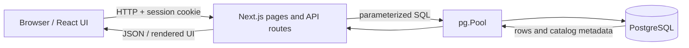
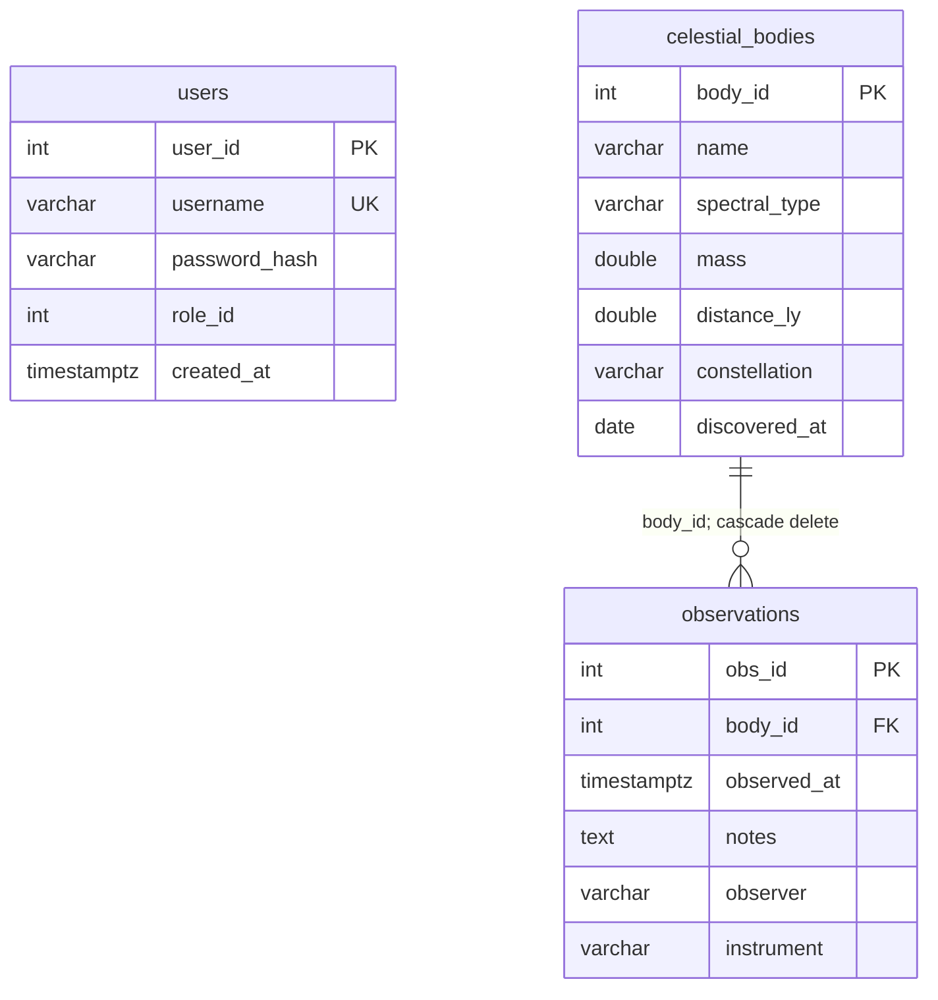
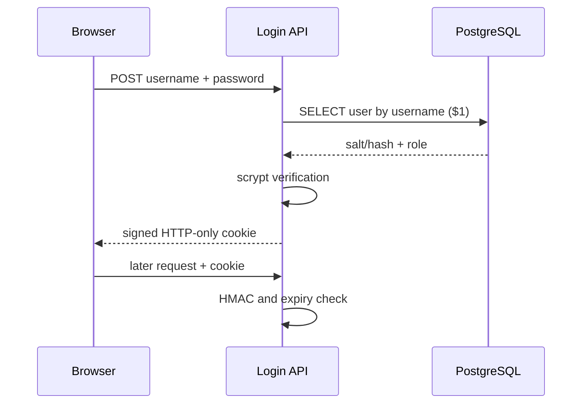

# Stellar Archive DBMS — faculty presentation guide

This is a technical reference for explaining the implementation. It describes the code as it exists in this repository. The companion [presentation-slides.md](presentation-slides.md) is the audience-facing 12-slide outline.

## 1. A one-minute explanation 

Stellar Archive is a web-based interface over a PostgreSQL database of celestial bodies and their observations. The database has three tables: `users`, `celestial_bodies`, and `observations`. A foreign key links each observation to an existing celestial body. The application lets authenticated users browse data and inspect live schema metadata. Administrators can also insert, update, and delete astronomical records and run bounded read-only SQL. The backend uses raw, parameterized SQL through `pg`, so the DBMS concepts are visible in the implementation rather than hidden behind an ORM.

The space animation is visual presentation; it does not store data or participate in SQL processing.

## 2. Where the important code lives

| Area | File(s) | What to explain |
| --- | --- | --- |
| Database initialization | `src/scripts/init-db.js` | DDL, constraints, indexes, transaction, seed data, account upserts |
| Connection | `src/lib/db.ts` | `pg.Pool`, environment configuration, connection reuse |
| Passwords/tokens | `src/lib/security.ts` | salted scrypt hashes and HMAC-signed sessions |
| Cookie/role helpers | `src/lib/session.ts` | cookie creation, session lookup, API permission checks |
| Login/logout | `app/api/auth/login/route.ts`, `app/api/auth/logout/route.ts` | authentication request flow |
| Contents API | `app/api/tables/[tableName]/contents/route.ts` | filtered reads, primary-key lookup, pagination |
| Schema API | `app/api/tables/[tableName]/constraints/route.ts` | `information_schema` and PostgreSQL catalog queries |
| CRUD API | `app/api/tables/[tableName]/modify/route.ts` | validated `INSERT`, `UPDATE`, `DELETE` |
| SQL workspace API | `app/api/rawsql/route.ts` | read-only transaction, time/row limits |
| Pages | `app/login/`, `app/dashboard/`, `src/components/modify/` | user flow and forms |
| Security tests | `test/security.test.mjs` | hash verification and token tamper/expiry cases |

## 3. Stack and runtime flow

- **Database:** PostgreSQL stores records and enforces constraints. The default database name is `stellar_archive`.
- **Backend:** Next.js 16 App Router route handlers execute on the server. They call PostgreSQL through `pg` (node-postgres). There is no ORM.
- **Frontend:** React 19 and TypeScript render the login, data grid, schema views, and edit forms. Tailwind CSS 4, regular CSS, and Lucide icons style them.
- **Configuration:** Next.js reads `.env.local`/`.env`. `DATABASE_URL` is used when present; otherwise separate `PGHOST`, `PGPORT`, `PGDATABASE`, `PGUSER`, and `PGPASSWORD` settings are used. `SESSION_SECRET` signs cookies. `ADMIN_USERNAME`/`ADMIN_PASSWORD` and optional viewer credentials are used by `db:init`.



**Key distinction:** The PostgreSQL connection password is for the server-to-database connection. The admin login password is for an application account in `users`. They are separate credentials.

## 4. Relational schema: every table and column

The initializer executes `CREATE TABLE IF NOT EXISTS`. `SERIAL` is a PostgreSQL integer column backed by a sequence; it auto-generates key values.

### `users`

| Column | SQL type and rules | Purpose |
| --- | --- | --- |
| `user_id` | `SERIAL PRIMARY KEY` | Account identifier |
| `username` | `VARCHAR(100) NOT NULL UNIQUE` | Login name |
| `password_hash` | `VARCHAR(255) NOT NULL` | Salted scrypt representation, never plaintext |
| `role_id` | `INTEGER NOT NULL DEFAULT 2 CHECK (role_id IN (1, 2))` | 1 = Admin, 2 = Viewer |
| `created_at` | `TIMESTAMPTZ NOT NULL DEFAULT NOW()` | Account creation timestamp |

There is **no separate roles table** and no FK from `users` to astronomical data. `role_id` is an application authorization value, not a PostgreSQL database role.

### `celestial_bodies`

| Column | SQL type and rules | Purpose |
| --- | --- | --- |
| `body_id` | `SERIAL PRIMARY KEY` | Body identifier |
| `name` | `VARCHAR(150) NOT NULL` | Object name |
| `spectral_type` | `VARCHAR(20)` | Optional stellar classification |
| `mass` | `DOUBLE PRECISION CHECK (mass >= 0)` | Optional mass in kilograms |
| `distance_ly` | `DOUBLE PRECISION CHECK (distance_ly >= 0)` | Optional distance in light years |
| `constellation` | `VARCHAR(100)` | Optional constellation |
| `discovered_at` | `DATE` | Optional discovery date |

`name` is not unique, so the database can contain two bodies with the same name. `DOUBLE PRECISION` is approximate floating-point storage; it suits the very large/small scientific values in the sample data but is not exact decimal arithmetic.

### `observations`

| Column | SQL type and rules | Purpose |
| --- | --- | --- |
| `obs_id` | `SERIAL PRIMARY KEY` | Observation identifier |
| `body_id` | `INTEGER NOT NULL REFERENCES celestial_bodies(body_id) ON DELETE CASCADE` | Parent body |
| `observed_at` | `TIMESTAMPTZ NOT NULL DEFAULT NOW()` | Observation time with timezone semantics |
| `notes` | `TEXT` | Optional notes |
| `observer` | `VARCHAR(100)` | Optional observer name |
| `instrument` | `VARCHAR(150)` | Optional instrument name |

`observer` is plain text; it is **not** linked to `users.user_id`. One body can have zero or many observations; every observation must have exactly one existing body. Deleting a body deletes its linked observations through PostgreSQL's `ON DELETE CASCADE` rule. Deleting an observation does not delete its body.



### DBMS concepts demonstrated by the schema

- **Entity integrity:** each table has a primary key. Update and Delete use that key to target a single record.
- **Referential integrity:** the observation FK prevents orphan observations. PostgreSQL returns SQLSTATE `23503` if an invalid `body_id` is inserted or updated.
- **Domain constraints:** `CHECK` rules restrict roles and nonnegative measurements. `NOT NULL` and `VARCHAR` lengths constrain values.
- **Defaults:** PostgreSQL supplies timestamps and the default viewer role when omitted.
- **Normalization:** body properties live once in `celestial_bodies`; repeated observations reference `body_id` instead of copying body attributes into every row. This is a straightforward one-to-many design. Do not claim a formal normal form proof without specifying functional dependencies.
- **Cascade behavior:** the FK defines what happens to child rows when a parent is removed.

## 5. Initialization, seed data, and transaction

Run `npm run db:init` after setting database access, `SESSION_SECRET`, and an `ADMIN_PASSWORD` of at least 12 characters. `db:init` requires the admin password; the session secret is required when issuing/verifying login sessions in the app.

The script obtains one PostgreSQL client and runs `BEGIN`. Within that transaction it creates the three tables and two additional indexes if missing; upserts the configured admin account; optionally upserts a viewer account; inserts six sample bodies only when `celestial_bodies` is empty; and inserts one baseline Sun observation only when `observations` is empty and Sun exists. It commits on success, or rolls back on error, then releases the client.

**Important idempotency nuance:** rerunning initialization does not duplicate existing sample data and uses `CREATE ... IF NOT EXISTS`. It **does reset configured account password hashes** to the current environment passwords. It does **not** alter an existing table to match later schema edits; that would require a migration. Existing celestial data and observations are preserved by the seed logic.

The sample bodies are Sun, Proxima Centauri, Sirius A, Betelgeuse, Vega, and Rigel. These are demonstration records; live row counts depend on the current database.

## 6. Indexes and query behavior

Explicit indexes created by the script:

```sql
CREATE INDEX IF NOT EXISTS observations_body_id_idx
  ON observations(body_id);
CREATE INDEX IF NOT EXISTS observations_observed_at_idx
  ON observations(observed_at DESC);
```

The first supports finding observations for a body and joins on `body_id`; the second is intended for recent-first observation access. PostgreSQL also creates indexes to support primary keys and the unique username constraint. An index uses storage and adds write overhead, so it should match real query patterns. The source code does not contain `EXPLAIN ANALYZE` results, so present these as design intentions rather than measured improvements.

### Example join to discuss

```sql
SELECT cb.name, o.observed_at, o.observer
FROM observations AS o
JOIN celestial_bodies AS cb ON cb.body_id = o.body_id
ORDER BY o.observed_at DESC;
```

This is an inner join: only observations with a matching body are returned. The FK guarantees a matching body for committed observation rows unless constraints are altered outside the app. To show bodies with zero observations, use a `LEFT JOIN` starting from `celestial_bodies`.

### Pagination

The Contents API runs a count query and then a selected-table query ordered by that table's PK, with `LIMIT $1 OFFSET $2`. Default page size is 25; the API rejects values over 100. A single-row `id` lookup uses the table's PK. The `users` contents query explicitly selects `user_id`, `username`, `role_id`, and `created_at`; it omits `password_hash`.

For very large tables, `OFFSET` pagination can become costly and concurrent inserts can shift pages. This small project uses it for clarity.

## 7. Authentication: step by step

1. `db:init` stores a randomly salted scrypt hash for the admin and, if configured, viewer. Format: `scrypt:<hex salt>:<hex derived key>`.
2. The login form posts a username/password to `/api/auth/login`.
3. The server queries `users` with `WHERE username = $1`. It passes the username as a parameter, not string-concatenated SQL.
4. `verifyPassword` derives a key from the supplied password and the stored salt, then compares keys with `timingSafeEqual`.
5. On success, `makeToken` encodes `{userId, username, roleId, expires}` and attaches an HMAC-SHA256 signature using `SESSION_SECRET`.
6. `setSession` sends the token in `stellar_session`: HTTP-only, `SameSite=Lax`, path `/`, maximum age eight hours, and `Secure` in production.
7. Server layouts and APIs parse/verify the cookie on later requests. A changed payload or expired token is rejected. Logout deletes the browser cookie.



**Clarify “session”:** the implementation uses a stateless signed cookie, not a server-side sessions table. It is signed for integrity, not encrypted for secrecy. Because the role is inside the signed payload, changing a user's role in the DB will not immediately change an already-issued cookie; it expires after up to eight hours, unless the secret rotates. Clearing the cookie logs out that browser, but there is no server-side token revocation list.

**Do not say:** “The password is encrypted and can be decrypted.” It is one-way hashed. Also do not call the cookie a JWT; it is a custom signed payload.

## 8. Authorization: Admin versus Viewer

| Operation | Admin, `role_id=1` | Viewer, `role_id=2` |
| --- | --- | --- |
| Browse table contents | Yes | Yes |
| Inspect Structure / Constraints | Yes | Yes |
| Insert, Update, Delete bodies/observations | Yes | No |
| Raw SQL workspace | Yes | No |
| Modify `users` through forms/API | No | No |

`app/dashboard/layout.tsx` redirects unauthenticated users to `/login`. `app/dashboard/modify/layout.tsx` redirects non-admin users away from the Modify page. More importantly, mutation and Raw SQL API routes independently call `requireApiSession(true)`, so hiding a button is not the security boundary. Read APIs call `requireApiSession()` without the admin requirement. Invalid login yields HTTP 401; an authenticated viewer attempting an admin API yields HTTP 403.

This is **application-level RBAC**. The app's PostgreSQL connection uses one configured DB account; the repository does not create separate PostgreSQL users or `GRANT`/`REVOKE` privileges for Admin and Viewer.

## 9. Data APIs and raw SQL details

### Allowed tables and fields

Read/metadata routes allow `users`, `celestial_bodies`, and `observations`. Write routes allow only `celestial_bodies` and `observations`. Their column allowlists permit the editable fields while excluding generated primary keys. SQL values are sent separately to `pool.query(sql, values)` as `$1`, `$2`, etc.

**Why both an allowlist and parameters?** PostgreSQL parameters represent data values, not SQL identifiers. The code must interpolate table and column names for a dynamic route, so it first checks them against fixed allowlists. This prevents a request path or JSON key from becoming arbitrary SQL syntax.

### DML examples to explain aloud

```sql
INSERT INTO "celestial_bodies" ("name", "mass")
VALUES ($1, $2) RETURNING *;

UPDATE "celestial_bodies" SET "name" = $1
WHERE "body_id" = $2 RETURNING *;

DELETE FROM "observations"
WHERE "obs_id" = $1 RETURNING *;
```

`RETURNING *` gives the affected row back in the same database round trip. Update and Delete require a positive primary-key value and report 404 when no row matches. Blank optional insert fields are omitted, allowing SQL defaults; blank update fields become `NULL`. Application validation checks nonnegative numeric values, reasonable string lengths, and required fields. PostgreSQL still enforces its own constraints. The API maps common SQLSTATE failures, such as FK and not-null/check violations, into readable HTTP 400 responses.

### Schema introspection query

The schema API asks `information_schema.columns` for column metadata. It also queries `pg_constraint`, joined with `pg_class` and `pg_namespace`, and uses `pg_get_constraintdef` for readable definitions. A table-name allowlist controls the requested table. Structure and Constraints pages both consume this API; they render different parts of the same response.

### Read-only SQL workspace

The Raw SQL API is Admin-only. It accepts text beginning with `SELECT` or `WITH`, blocks direct references to `pg_shadow` and `pg_authid`, starts `BEGIN READ ONLY`, sets a five-second statement timeout, wraps the supplied query in an outer `SELECT ... LIMIT 101`, and returns at most 100 rows plus a `truncated` indicator. The read-only transaction is the important DB-side protection against writes; the text checks alone are not a full SQL parser. Query results can include arbitrary readable columns. In particular, an admin could query `users.password_hash` through this workspace even though the Contents API hides that column. Do not describe the workspace as a general-purpose sandbox or claim that it masks sensitive columns.

## 10. Suggested live demonstration

1. Ensure PostgreSQL is running and the app is configured. Run `npm run db:init` before the demo, then `npm run dev`.
2. Sign in as Admin. Show the username and Administrator badge.
3. Open Contents, choose `celestial_bodies`, show row count, pagination if enough rows, and the row detail drawer.
4. Open Structure for `observations`: show `obs_id`, `body_id`, types, nullability, and default timestamp.
5. Open Constraints: show `observations_body_id_fkey`, the PK, and `ON DELETE CASCADE`.
6. Insert a **disposable** body such as “Demo Object”; record its returned `body_id`.
7. Insert an observation with that `body_id`. Run the preset join query in Raw SQL to show related data.
8. Update a field by PK. Show the `UPDATE ... WHERE ... RETURNING *` preview and result.
9. If appropriate, delete the disposable body after explaining that its observation also disappears. The UI shows a confirmation and cascade warning.
10. If a viewer account was configured, sign in as Viewer and show that Modify is absent and its API still rejects an admin action.

Avoid presenting hard-coded row counts: the current database may differ from seed data. Do not display `.env` files or credentials on screen.

## 11. Common faculty questions and concise answers

**Why PostgreSQL?** It provides relational constraints, foreign keys with cascading actions, transactions, indexes, system catalogs, and `RETURNING`, all directly demonstrated by this project.

**Why a separate observations table?** A body can have many observations. A separate table avoids repeating body properties for every log entry and gives each observation its own key and timestamp.

**What happens if an observation references a missing body?** PostgreSQL rejects it via the FK; the API turns SQLSTATE `23503` into a readable client error.

**What happens if you delete a body?** PostgreSQL automatically deletes its linked observations because the FK specifies `ON DELETE CASCADE`. The UI warns before deletion.

**What are the candidate/primary keys?** The chosen primary keys are `user_id`, `body_id`, and `obs_id`. `users.username` is also unique and can identify an account; the other names are not declared unique.

**What prevents SQL injection?** Bound parameters protect values. Fixed allowlists protect dynamic table and column identifiers. The Raw SQL workspace is intentionally an admin-only query feature and is governed separately by a read-only transaction and limits.

**What is the difference between authentication and authorization?** Authentication verifies the password and creates a signed session. Authorization checks the session's role before allowing an operation.

**Is the admin a PostgreSQL superuser?** `role_id=1` is an app role. PostgreSQL connection privileges depend on the configured DB account and are separate.

**How do you know the schema view is current?** It queries PostgreSQL metadata on request. It is not a static copy of the DDL script.

**What is a transaction here?** `db:init` groups setup steps between `BEGIN` and `COMMIT`, rolling back if any step fails. The Raw SQL workspace also uses a read-only transaction for query execution.

**What are the limitations?** There is no migration system, user-management UI, server-side session revocation, or DB integration test suite. The account setup is configuration-driven. The admin Raw SQL workspace can query any data readable by the configured DB account.

## 12. Checks and practical troubleshooting

Commands: `npm run db:init`, `npm run dev`, `npm test`, `npm run lint`, `npx tsc --noEmit`, and `npm run build`.

- **Login 401:** the account or password does not match the stored hash. Rerun `db:init` with the intended `ADMIN_PASSWORD` if a reset is needed.
- **Login 503:** the login handler caught a server-side problem such as a DB query failure or missing/short `SESSION_SECRET`. Check server logs and configuration.
- **Protected API 401:** no valid signed session cookie.
- **Admin API 403:** a signed-in Viewer attempted an admin operation.
- **Insert observation 400:** check whether `body_id` exists and whether required fields/types satisfy PostgreSQL constraints.
- **Schema or contents 500:** check PostgreSQL connectivity, table setup, and server logs.

The repository's automated test file checks hashing and token tamper/expiry behavior. It does not prove that every UI or database route works against a live PostgreSQL instance. For a course demo, perform the walkthrough above with the configured database.
